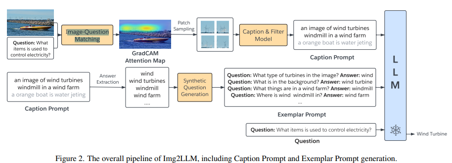

# Template is all you need

## Image Captioning
### Ideas
- VQA + Chatgpt 

### Related Works
- [ChatGPT Asks, BLIP-2 Answers: Automatic Questioning Towards Enriched Visual Descriptions](https://arxiv.org/pdf/2303.06594.pdf): use BLIP-2 to generate caption first, design a prompt to instruct llm to ask high-quality questions based on the generated caption. use these questions and BLIP-2 to accomplish VQA task. Finally, use chatgpt to generate the new caption based on the VQA history.

- 

## VQA
- [From Images to Textual Prompts: Zero-shot Visual Question Answering with
Frozen Large Language Models](https://arxiv.org/pdf/2212.10846.pdf):
    - First use the question to cut the image into several patches, perform    Image-Question Matching to select related patches.
    - Generate image captions of related patches as question-related captions.
    - Extract keywords of the captions as answers, generate question-answer pairs according to the keywords and captions.
    - Cat related captions and QA-pairs together as LLM's input to generate answer.
    
    
- 

## Image Expansion

## Action Recognition

